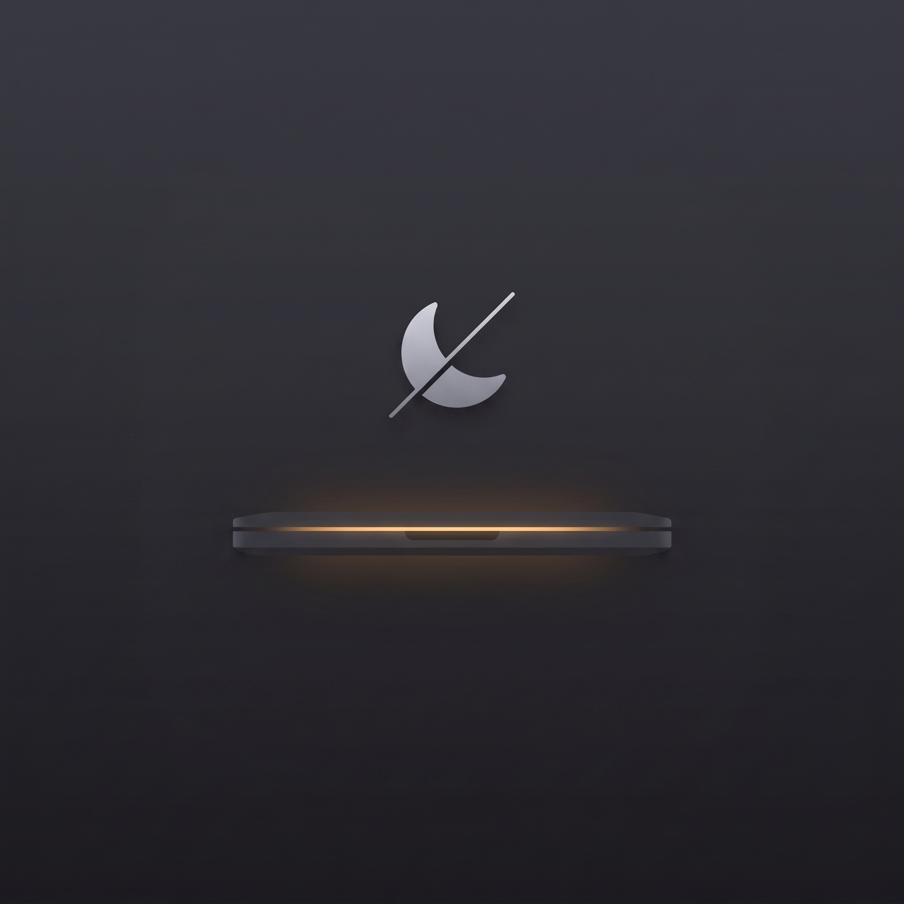

# Sleep Mac AI

Крошечное приложение в меню-баре macOS, которое не даёт MacBook уснуть с закрытой крышкой — для долгих запусков ИИ-агентов, сборок и загрузок.

🇬🇧 [English readme](README.md)



## Зачем

`caffeinate` **не** спасает при закрытой крышке. Работает только `pmset -a disablesleep 1`. Это приложение — переключатель этого флага в один клик, чтобы не вспоминать команду и не забывать выключить режим обратно.

- **🌙 Обычный режим** — штатное поведение macOS, засыпает при закрытии крышки
- **⚡ ИИ режим** — не спит никогда, с открытой крышкой и с закрытой

## Установка

**Из DMG** — скачайте `AI Sleep.dmg` из [Releases](../../releases), откройте, перетащите приложение в «Программы».

Первый запуск: подпись самодельная, поэтому macOS предупредит о неизвестном разработчике. Правый клик по приложению → **Открыть** → **Открыть**. Один раз.

**Из исходников** — нужны Xcode Command Line Tools (`xcode-select --install`):

```bash
git clone https://github.com/ilnarisakov/sleep-mac-ai.git
cd sleep-mac-ai
./build.sh                 # собирает «AI Sleep.app»
cp -R "AI Sleep.app" /Applications/
```

## Переключение без пароля (рекомендуется)

`pmset` требует root. Без настройки каждое переключение будет спрашивать пароль. Выполните один раз:

```bash
./nopasswd.sh
```

Скрипт создаёт `/etc/sudoers.d/aimode` и разрешает ровно две команды без пароля:

```
pmset -a disablesleep 1
pmset -a disablesleep 0
```

Больше ничего. Отменить: `sudo rm /etc/sudoers.d/aimode`.

## Автозапуск

Системные настройки → Основные → «Объекты входа и расширения» → «Открывать при входе» → **+** → `AI Sleep`.

## Язык

Меню → **Язык** → Системный / English / Русский. По умолчанию следует языку macOS.

## Потребление ресурсов

| Метрика | Значение |
|---|---|
| Память | ~15 МБ |
| CPU в простое | 0.0 % |
| Таймеры / опросы | нет |

В фоне приложение не делает ничего — `pmset -g` вызывается только в момент открытия меню.

## Сборка DMG

```bash
./build-dmg.sh
```

## Тесты

```bash
./test.sh    # проверяет, что парсер pmset совпадает с реальным флагом
```

## Важно

В ИИ режиме с закрытой крышкой батарея садится — компьютер полностью бодрствует. Возвращайтесь в обычный режим, когда закончили, либо держите ноутбук на зарядке.

## Лицензия

MIT
